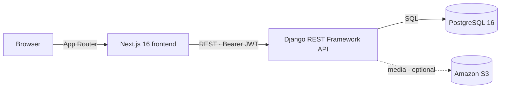

<p align="center">
  
</p>

<h1 align="center">ROTA LMS</h1>

<p align="center">
  Free, modern, self-hosted Learning Management System.<br/>
  Built with <strong>Next.js</strong> and <strong>Django REST Framework</strong>.
</p>

<p align="center">
  <a href="https://github.com/neutroncl/rotalms/blob/main/LICENSE"></a>
  <a href="https://github.com/neutroncl/rotalms/actions/workflows/backend.yml"></a>
  <a href="https://github.com/neutroncl/rotalms/actions/workflows/frontend.yml"></a>
  <a href="https://github.com/neutroncl/rotalms"></a>
  <a href="https://github.com/neutroncl/rotalms"></a>
</p>

> [!NOTE]
> ROTA is under active development. The API, UI, and deployment flow are evolving and are not yet recommended for production use.

---

## Table of Contents

- [Overview](#overview)
- [Features](#features)
- [Tech Stack](#tech-stack)
- [Architecture](#architecture)
- [Project Structure](#project-structure)
- [Getting Started](#getting-started)
- [Configuration](#configuration)
- [API Documentation](#api-documentation)
- [Testing](#testing)
- [Deployment](#deployment)
- [CI / CD](#ci--cd)
- [Roadmap](#roadmap)
- [Contributing](#contributing)
- [License](#license)

## Overview

ROTA is a free, open-source Learning Management System designed for developers and educators who want a fast, modern, self-hosted platform for managing courses, lessons, and users. It ships as two packages:

- **`backend/`** — a Django 6 + Django REST Framework API with passwordless login, JWT auth, and an auto-generated OpenAPI schema.
- **`frontend/`** — a Next.js 16 App Router application with server components, a typed API client, and a shadcn-style UI kit.

## Features

### Authentication

- **Passwordless email OTP login** — no passwords to store, leak, or reset
- **JWT with rotating refresh** — 15-minute access tokens and a 365-day rolling refresh window (rotation + blacklist)
- Profile onboarding gated by a `profile_complete` claim embedded in the token
- Rate-limited OTP endpoints and an **email sandbox mode** that returns the OTP in the response for local testing

### Courses

- Categories with ordering and emoji, featured-course promotion
- Cover images auto-optimized on upload (EXIF fix, resize, WebP conversion)
- Public paginated course listing with category filtering

### Quizzes

- Draft/publish workflow, single-attempt and pass-score settings, randomized question order
- Public serializers never expose correct answers or drafts; full CRUD for admins
- Optimized image handling for question and answer pictures

### Support Tickets

- Short 8-character ticket IDs with priority and status lifecycle (answered → in progress → closed)
- Comment threads with file attachments and staff assignment
- Sanitized content (bleach) and validated uploads (JPG/PNG/PDF, max 5 MB)

### Frontend

- Next.js App Router with server components and server actions
- TanStack Query data fetching + TanStack Table admin data table (filtering, sorting, pagination, row selection)
- Typed API client with an endpoint registry, dark mode, pino logging

### Platform

- Interactive API docs generated from the live code (Swagger UI + ReDoc)
- Docker images and Docker Compose stack with health checks and resource limits
- CI on every push and PR for both packages

## Tech Stack

| Area | Technology |
| --- | --- |
| Frontend | Next.js 16, React 19, TypeScript 5, Tailwind CSS 4 |
| UI | shadcn/ui on Base UI, TanStack Query, TanStack Table, lucide icons |
| Backend | Django 6.1, Django REST Framework 3.18 |
| Auth | djangorestframework-simplejwt (rotating refresh + blacklist) |
| API docs | drf-spectacular (OpenAPI 3.0) |
| Database | PostgreSQL 16 (SQLite in development mode) |
| Media storage | Local filesystem, optional Amazon S3 via django-storages |
| Python tooling | uv, Python 3.14 |
| JS tooling | Bun |
| Serving | Gunicorn (backend), Next.js server (frontend) |
| Infra | Docker, Docker Compose, GitHub Actions |

## Architecture



The frontend talks to the API through a typed client (`frontend/lib/api`) that attaches the JWT from httpOnly server cookies. The API is versioned under `/api/v1/` and documents itself with drf-spectacular.

## Project Structure

```
rotalms/
├── backend/                  # Django + DRF API
│   ├── rota/                 # project settings, root urls, renderers
│   ├── core_auth/            # users, passwordless OTP, JWT
│   ├── course/               # categories & courses
│   ├── quiz/                 # quizzes, questions, answers
│   ├── ticket/               # support tickets & comments
│   ├── utils/                # image optimization, upload validation
│   ├── schema.yml            # committed OpenAPI schema
│   ├── Dockerfile            # multi-stage production image (gunicorn)
│   ├── docker-compose.yaml   # web + postgres stack
│   └── deploy.py             # Fabric-based deploy script
├── frontend/                 # Next.js 16 (App Router)
│   ├── app/                  # routes (/, /admin, ...)
│   ├── components/           # UI kit, admin data table, dialogs
│   ├── lib/api/              # typed API client + endpoint registry
│   ├── actions/              # server actions
│   └── types/                # shared TypeScript types
├── .github/workflows/        # CI for backend and frontend
├── logo.svg
└── LICENSE
```

## Getting Started

### Prerequisites

- Python 3.14+
- [uv](https://docs.astral.sh/uv/)
- [Bun](https://bun.sh/) (or npm)
- PostgreSQL 16 (required only when `DEBUG=False`, e.g. Docker deployment)

### 1. Backend

```bash
cd backend

# create your environment file from the template
cp .env.example .env        # Windows: copy .env.example .env

# install dependencies and apply migrations
uv sync
uv run python manage.py migrate

# optional: seed demo categories & courses
uv run python manage.py seed_data

# start the dev server
uv run python manage.py runserver
```

With `DEBUG=True` the backend uses SQLite and `EMAIL_SANDBOX` returns the OTP directly in the response, so no mail server or database is needed for local development.

### 2. Frontend

```bash
cd frontend

bun install
bun run dev
```

The frontend defaults to calling the API on the same origin. To point it elsewhere:

```bash
NEXT_PUBLIC_API_BASE_URL=http://localhost:8000 bun run dev
```

## Configuration

All backend settings are read from `backend/.env` (see `backend/.env.example` for a template).

| Variable | Purpose | Default |
| --- | --- | --- |
| `DEBUG` | SQLite + debug OTP + debug errors | `False` |
| `SECRET_KEY` | Django secret key — **required in production** | — |
| `ALLOWED_HOSTS` | Comma-separated host list | `*` |
| `POSTGRES_DB` / `POSTGRES_USER` / `POSTGRES_PASSWORD` | Database credentials (used when `DEBUG=False`) | — |
| `POSTGRES_HOST` / `POSTGRES_PORT` | Database location | `localhost:5432` |
| `EMAIL_SANDBOX` | Return the OTP in the API response instead of sending email | `True` |
| `USE_API_ENVELOPE` | Wrap responses in `{success, data, client_msg, dev_msg}` | `False` |
| `USE_S3` + `AWS_S3_*` | Serve media from Amazon S3 instead of the local filesystem | disabled |

Frontend:

| Variable | Purpose | Default |
| --- | --- | --- |
| `NEXT_PUBLIC_API_BASE_URL` | API origin | same origin |

## API Documentation

The API documents itself from live code:

| Endpoint | Description |
| --- | --- |
| `/api/docs/` | Swagger UI |
| `/api/redoc/` | ReDoc |
| `/api/schema/` | Raw OpenAPI 3.0 schema (also committed at [`backend/schema.yml`](backend/schema.yml)) |

Authentication is passwordless: `POST /api/v1/auth/otp/request/` sends a one-time code, and `POST /api/v1/auth/otp/verify/` exchanges it for an access/refresh JWT pair. Authenticated calls send `Authorization: Bearer <access_token>`.

## Testing

```bash
# backend
cd backend
uv run python manage.py test

# frontend
cd frontend
bun run lint
bun run typecheck
bun run build
```

## Deployment

### Docker Compose

The [`backend/docker-compose.yaml`](backend/docker-compose.yaml) stack runs the API (Gunicorn, non-root user, resource limits) alongside PostgreSQL 16 with a health check.

```bash
cd backend

# one-time: create the external postgres volume
docker volume create rota_backend_rota_pgdata

# fill in .env, then build & start
docker compose up -d --build
```

| Service | Host port | Notes |
| --- | --- | --- |
| `rota_web` | `31247` | Gunicorn serving the API |
| `rota_db` | `64510` | Maps to Postgres `5432` inside the network |


## CI / CD

| Workflow | Triggers | Steps |
| --- | --- | --- |
| [Backend CI](.github/workflows/backend.yml) | push / PR on `backend/**` | `uv sync` → `manage.py check` → migration drift check → `manage.py test` |
| [Frontend CI](.github/workflows/frontend.yml) | push / PR on `frontend/**` | `bun install` → eslint → `next build` |

## Roadmap

> Subject to change — this is where the project is heading.

- Course, quiz, and lesson pages on the frontend (API is ready; UI is next)
- Lecture/lesson content model on top of `CourseItem`
- Quiz-taking flow with single-attempt and pass-score enforcement
- Social login via django-allauth
- Frontend test suite and broader backend API test coverage
- Containerized frontend deployment
- Production hardening (rate limits, monitoring, backups)

## Contributing

Contributions are welcome — feel free to open issues for bugs and ideas, or submit pull requests. Please target `main` and keep changes scoped to one package (`backend/**` or `frontend/**`) so CI runs the right checks.

## License

ROTA is released under the [MIT License](LICENSE). © 2026 Neutron Creative Lab.
